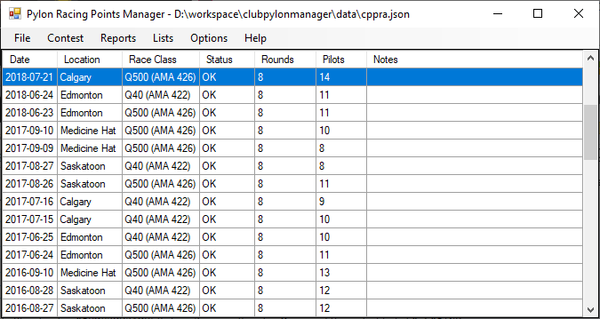
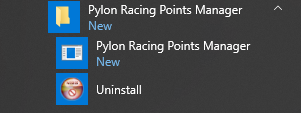
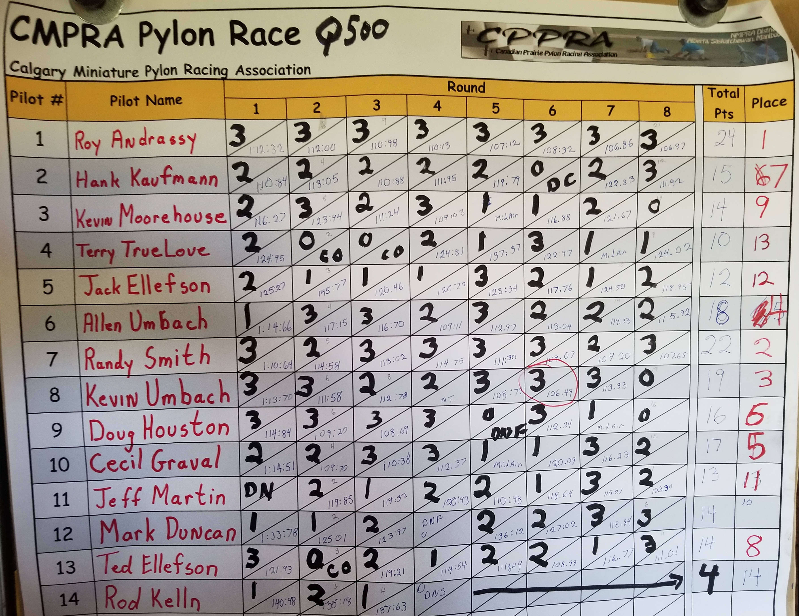
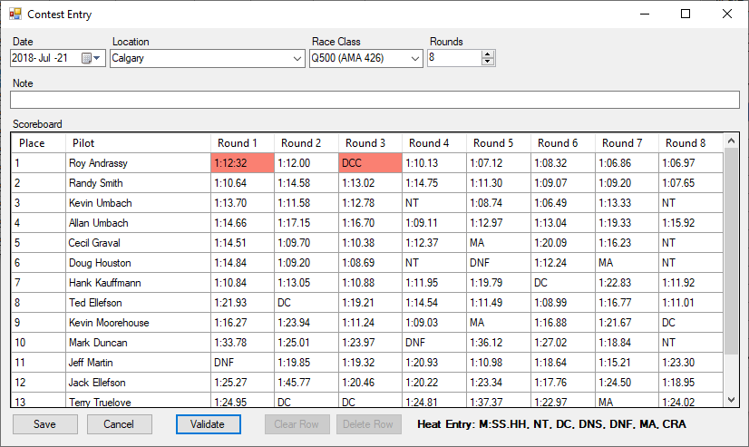
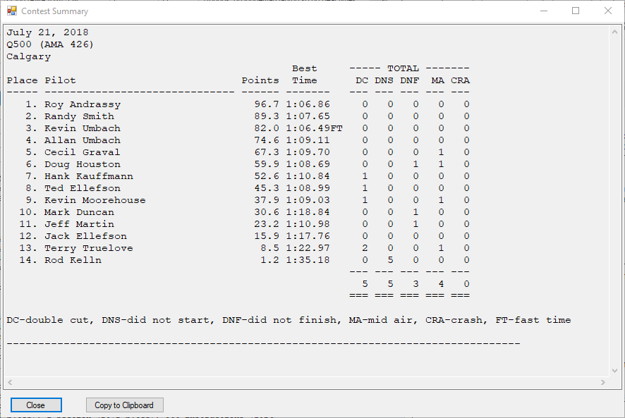
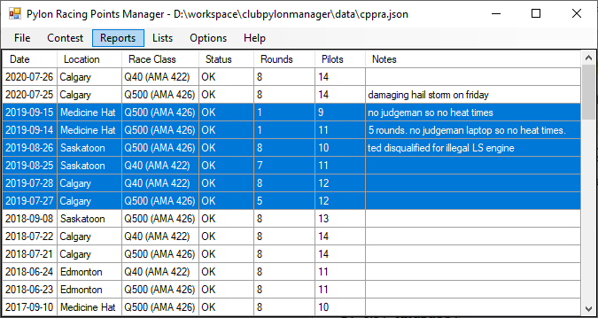
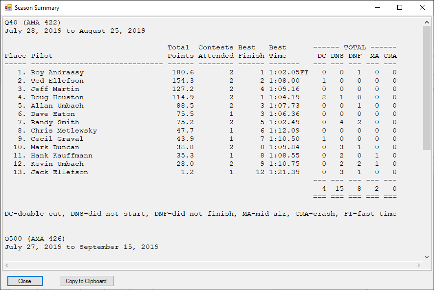
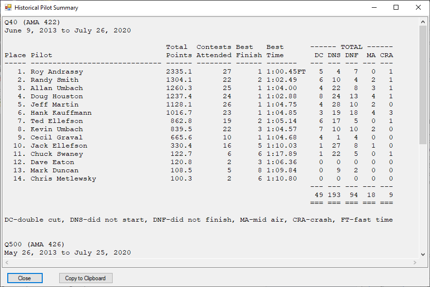

# Pylon Racing Points Manager
This application is used to maintain contest results, the season points race,
and the historical pilot statistics seen on the [Canadian Prairie Pylon Racing Association](http://cppra.org) website. 

It could be used by other racing clubs that want to show contest results 
and track pilot points.

To see what it can be used to produce, see these examples on the CPPRA website:
* [Contest results](http://www.cppra.org/a/cppra.org/main/results/calgary-q500-july-21-2018)
* [Points Race](https://sites.google.com/a/cppra.org/main/history/2018/q500-points)
* [Pilot History](http://www.cppra.org/pilot-stats)



## Requirements
Windows 7 or higher and .NET Framework 4.5.2 or higher. Typically .NET 
will already be installed on your system but if not you can 
download and install the .NET framework from Microsoft's website:
https://dotnet.microsoft.com/download/dotnet-framework

## Installation
Download and run the installer from GitHub: https://github.com/kumbach/PylonRacingPointsManager/releases

The installer will add a folder named 'Pylon Racing Points Manager' to your Start Menu containing these items:
* 'Pylon Racing Points Manager' - use this link to launch the application.
* 'Uninstall' - use this to uninstall the application.

## Launch the Application
On the Windows Start Menu, look for a folder named 'Pylon Racing Points Manager'. Open it and select 'Pylon Racing Points Manager'.



## Typical Points Tracking Workflow
These next sections outline how the CPPRA uses the application to show contest results, the season points race status, and display historical pilot details.
###Create a new Document File
To start off using the application, the first step is to create a new document file by selecting the File / New menu item. A document contains the contest results, and the pilot, race class, and location lists.

### Save the Document File
Save the document by selecting File / Save and giving the document a filename. 

Saving a document will overwrite the previous file contents so be careful and be sure to back up the document file frequently. 

### Pre-populating List Data
You can use the various list entry screens to pre-add pilots, race classes, and race locations for data entry convenience. See the Lists menu options.

Pre-populating the pilots list will provide autocomplete in the pilot name column to speed up entry and help avoid typos. When saving a valid contest, pilots are automatically added to the pilot list. 

Adding race classes and locations makes them available via drop-down lists on the contest entry screen for convenience.

Note: Changes made to a pilot in the Pilot List will be NOT reflected in contest records.
 
### Contest Scoreboard Entry
After a contest is over, the scoreboard results are entered into the 
application. The final pilot placings are determined by the Contest 
Director and are not calculated by the application. It is helpful 
to have a nice clean scoreboard with legible heat times and codes, 
and the final pilot placings marked. Although heat points and the 
total points for each pilot are used to determine final placings, they
are not entered into or tracked by the application.

This example scoreboard contains all the details needed by the application: 


Create a new Contest record by selecting the Contest / New Contest 
menu item. Then enter the contest information and the scoreboard details
for each pilot. Enter heat times using M:SS.HH format like '1:12.32' for
example. The heat code legend is indicated on the screen for future reference.

The heat codes are:
```
NT - no time
DC - double cut
DNS - did not start
DNF - did not finish
MA - mid air
CRA - crash
```
When pressing the Save or Validate buttons, the scoreboard entry will be validated 
and all invalid entries will be marked in red. Hovering the mouse over a highlighted 
error will show more details. In this example, Roy's round 1 time of '1:12:32' is 
not valid because it contains a colon instead of a period and 'DCC' is not a valid 
code. 


You can still save a record with errors or missing details and come back later 
to complete it.

After saving a contest record, it will appear highlighted in the main 
list. The Status column will indicate 'OK' if there are no entry errors,
or 'Errors' if something is wrong. If the status is 'Errors', the contest
will not be included in any reports until the errors are corrected.


### Contest Summary Report
After the contest details have been entered, the contest summary report 
can be generated. This report summarizes a contest to show the placings, 
pilot name, NMPRA points earned, and summary of heat results. 

To generate the report, first highlight the contest record and then 
select Reports / Contest Summary. The report details can be copy and 
pasted into a web page for viewing.


### Season Points Race
To show the overall points for the season, first highlight all the
 records in the season. Then select the Reports / Season Summary menu 
 option. In this example, all the contests for Q500 and Q40 in 2019 have 
 been selected.


The season summary report shows totals grouped by race class. Again, 
copy and paste the report contents into a web page for viewing.


### Pilot History Report
The Historical Pilot Summary report shows a summary of all the 
contests on file. The report is grouped by race class. To view it, 
select Reports / Historical Pilot Summary. 

If you don't back-fill your contest results, this report may not be useful to you.

## Importing Data

Note: Importing is experimental. Check your import results before 
saving the document file.
### Pilots
* File format is CSV with 1-3 fields.
    * Field 1: Pilot Name
    * Field 2: Pilot Number
    * Field 3: Active indicator. May be 'yes' or 'no'.

Example file pilots.csv:
```
Kevin Umbach,32x,yes
Allan Umbach,31x,yes
```
* Do not include column headers.
* Column 1 is required, the others are optional.
* If 'active' column is not specified, default value is 'yes'.

### Contests
* File format is CSV with a specially formatted contest header record.

Example file contests.csv:
```
2020-07-01,Q500 (AMA 426),Saskatoon
1,Kevin Umbach,nt,nt,nt,nt,nt,nt,nt,nt
2,Bob Hover,nt,nt,nt,nt,nt,nt,nt,nt

2020-07-02,Q40 (AMA 422),Saskatoon
1,Kevin Umbach,nt,nt,nt,nt,nt,nt,nt,nt
2,Bob Hover,nt,nt,nt,nt,nt,nt,nt,nt
```
* Do not include any column headers.
* Leave a blank line between contests.
* Ensure each pilot row in a contest has the same number of heats.


